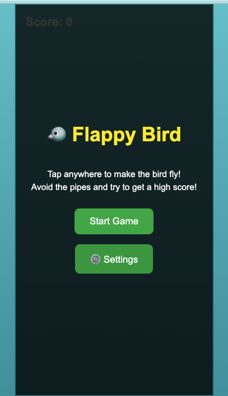
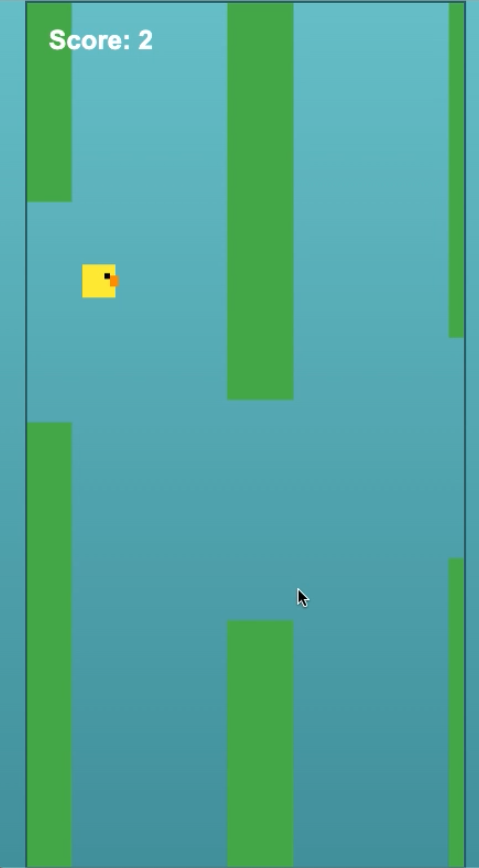
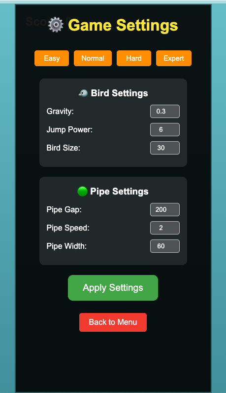

# 🐦 Flappy Bird Game

A simple, mobile-friendly Flappy Bird game built with pure HTML, CSS, and JavaScript. Perfect for kids and beginners to learn game development!

## 🎮 Features

- **Single File Game**: Everything in one `index.html` file - no dependencies!
- **Mobile Optimized**: Designed for vertical mobile screens with touch controls
- **Configurable Settings**: Customize gravity, jump power, pipe gaps, and more
- **Difficulty Presets**: Easy, Normal, Hard, and Expert modes
- **Responsive Design**: Works on phones, tablets, and desktop browsers
- **Instant Deploy**: Just upload to any web server and play!

## 🚀 How to Play

1. **Tap or Click** anywhere on the screen to make the bird fly up
2. **Avoid the green pipes** - don't let the bird hit them!
3. **Don't hit the ground or ceiling** - keep the bird flying
4. **Score points** by flying through the gaps between pipes
5. **Try different difficulty levels** to challenge yourself!

## ⚙️ Game Settings

The game includes a comprehensive settings system:

### 🎯 Difficulty Presets
- **Easy**: Slower gravity, bigger gaps, gentle speed - perfect for learning!
- **Normal**: Balanced gameplay for casual fun
- **Hard**: Faster action with smaller gaps - for experienced players
- **Expert**: Maximum difficulty for true Flappy Bird masters

### 🔧 Custom Settings
- **Bird Settings**: Adjust gravity, jump power, and bird size
- **Pipe Settings**: Customize gap size, speed, and pipe width
- **Real-time Changes**: Settings apply immediately without restarting

## 📱 Installation & Setup

### Play Locally
1. Download the `index.html` file
2. Open it in any web browser
3. Start playing immediately!

### Deploy to Web Server
1. Upload `index.html` to your web hosting
2. Share the URL with friends
3. No server configuration needed!

### Mobile Installation
1. Open the game in your mobile browser
2. Add to home screen for app-like experience
3. Works offline once loaded!

## 🛠️ Technical Details

- **Pure Web Technologies**: HTML5, CSS3, JavaScript (ES6+)
- **Canvas-based Graphics**: Smooth 60fps gameplay
- **Responsive Design**: Adapts to any screen size
- **Touch & Keyboard Support**: Works on all devices
- **No Dependencies**: Zero external libraries or frameworks

## 📸 Screenshots

### Main Menu

*Clean, simple interface with easy navigation*

### Gameplay

*Smooth, responsive bird movement with colorful graphics*

### Settings Screen

*Comprehensive settings with difficulty presets and custom options*

## 🎯 Perfect For

- **Kids Learning Programming**: Simple, readable code structure
- **Mobile Gaming**: Optimized touch controls and responsive design
- **Web Development Practice**: Great example of vanilla JavaScript game
- **Quick Entertainment**: Instant play, no downloads required
- **Educational Projects**: Demonstrate game physics and canvas rendering

## 🌟 Game Highlights

- **Beginner-Friendly**: Designed for an 11-year-old programmer
- **Educational Code**: Clean, well-structured JavaScript for learning
- **Mobile-First**: Touch controls and vertical layout optimization
- **Customizable**: Extensive settings system for personalized gameplay
- **Lightweight**: Single 18KB file with everything included

## 🎨 Customization

Want to modify the game? The code is designed for easy customization:

- **Colors**: Change the CSS gradient backgrounds
- **Game Physics**: Adjust the `gameSettings` object
- **Bird Appearance**: Modify the `drawBird()` function
- **Pipe Design**: Update the `drawPipes()` function
- **Add Features**: Extend with power-ups, sounds, or animations

## 📝 License

This project is designed for educational purposes. Feel free to use, modify, and share!

## 🤝 Contributing

This is a simple educational project, but suggestions and improvements are welcome! Perfect for beginners learning git and web development.

---

**Enjoy the game! 🎮 Happy flying! 🐦**